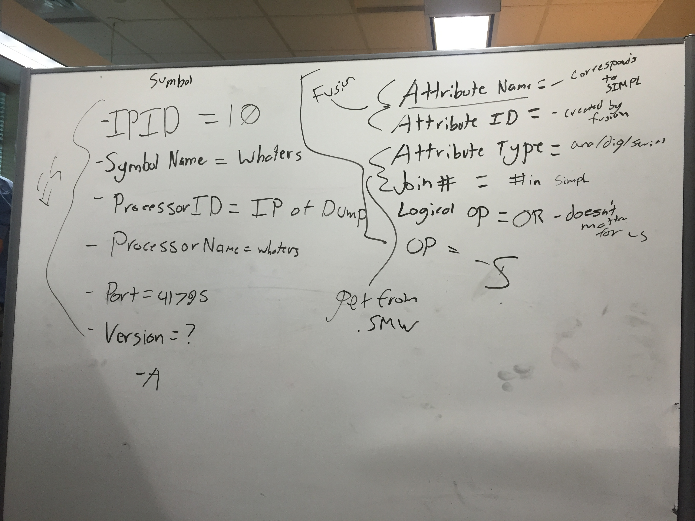

Crestron Definitions:

- `Attributes` are the same thing as `Signals`
- `Signals` are the individual "variables" we can see in Roomview
- `Processors` area source where you can get `Symbols`
- `Rooms` contain one or more `Processors`
- `Symbols` are containers of `Signals`
- `Assets` are contained by `Rooms` (don't worry about this for now)

Steps for Populating Fusion:

1. Autodiscover a room (with correct symbols, etc.)
1. Delete that room
1. Delete its attendant processor (TODO: Figure out how to programmatically delete all processors from Fusion)
1. Copy the latest `.smw` file to the local directory
1. Rename `.smw` to `.txt`
1. Point `SMWLocation` in `config.json` to the `.txt`
1. Open the `.txt` file and search-and-replace "System Power On" with "System Power"
1. Use `crestron-fusion-add-host` to pull attributes from Fusion and save them to `attributes.json` and nab information from the `.smw` file to populate `signals.json` via `crestron-fusion-add-host -op S`
1. Use `crestron-fusion-add-host` to add the rooms into Fusion pulling room inforat `crestron-fusion-add-host -op A`

